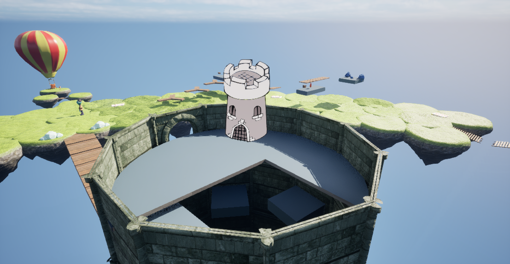

**Castle Guy** is the antagonist of the game. He is located at the top of the tower, and steals the Shards from the player when they confront him during the ending. He uses them to propell the player into deep space, and then carries out an unknown plan of action. It is rumored that this was the destruction of the tower, thereby giving this game "tragedy" status. He is suspected to be some sort of supernatural entity, given his ability to use Shards more effectively than Doozy.

## Trivia
* Castle Guy was also a twist villian in the demo version, initially appearing to help the player by training them for the full game.