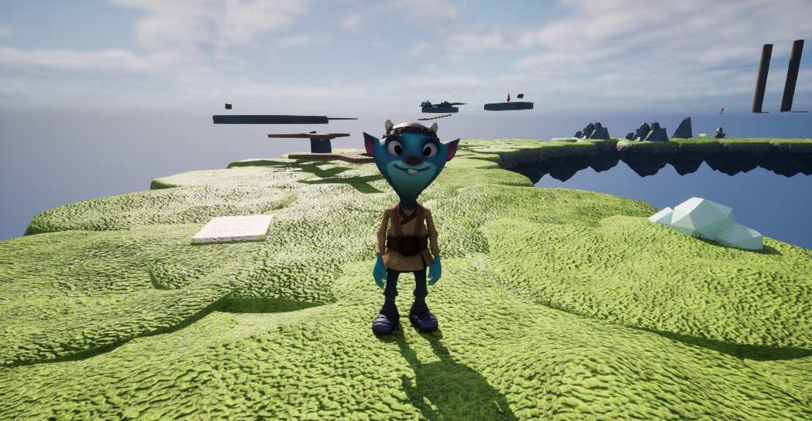

**Doozy** is an NPC who posses the fifth and final Shard. He has a blue, goofy, elf-like appearance. Unlike Mousey, he is not a native islander, and has suspected origins Norwegian origins due to his outfit. He speaks with a quasi-Southern accent and is known to "enjoy challenges". It has been rumored that he is only temporarily stationed in the island, as he is under contract to stand guard and challenge travellers to race around the island.

## Trivia
* He doesn't bother to check if the player has actually collected the Shards before proposing his challenge to them. He will also not check if the player has fully lapped the island during his challenge. It is suspected that he may be suffering from early onset memory loss.
* Doozy is rumored to be found in many other Introduction to Game Design final projects, so it is suspected that he has access to powerful teleportation devices. This may be why he posses a Shard.