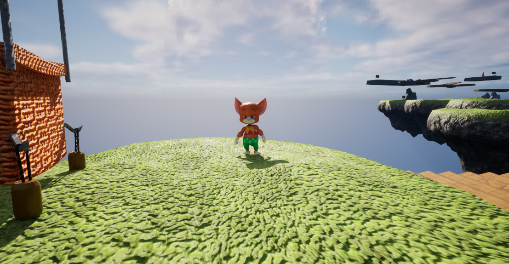

**Mousey** is an NPC that introduces the main plotline to the player. She is a native islander and is one of only two inhabitants to be concerned about the fate of their tower. She has a minute, mouse-like appearance, and bears resemblance to Jerry from Tom and Jerry.

## Trivia
* Mousey's relatives are often found in other games, particularly those in Introduction to Game Design classes. However, unlike Doozy, these doppelgangers are known to be separate persons, and do not imply mysterious forms of transportation.
* Mousey is the only NPC in the game to not require anything physical of the player.