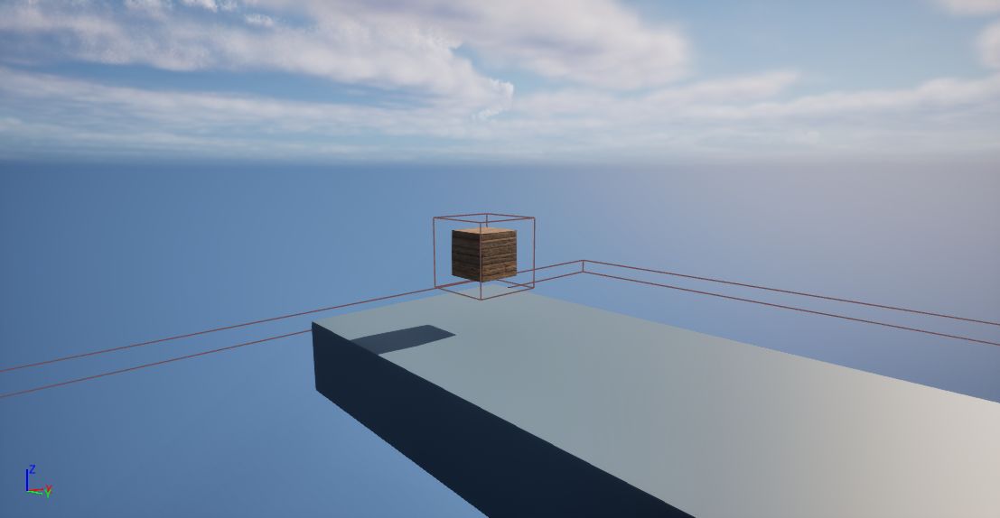

**Bridge Parts** are small collectibles seen hovering around the map near [shards](/content/docs/collectibles/shard). They are used to create the final bridge to the tower to access the [ending](/docs/information/ending.dx). Bridge Parts are normally seen hovering up and down until the player gets near to them and absorbs them. There are 12 bridge parts scattered across the map, with three for each of the main shards. Some of them are located on the course for each shard, while others may be hidden in the areas surrounding a shard.

## Trivia
 * There are 12 Bridge Parts in total, but only 11 are needed to reach the tower
 * Bridge Parts remain collected even if you die
 * The [Lunge Shard](/docs/collectibles/shard2) is the only shard to have only two Bridge Parts nearby. The other