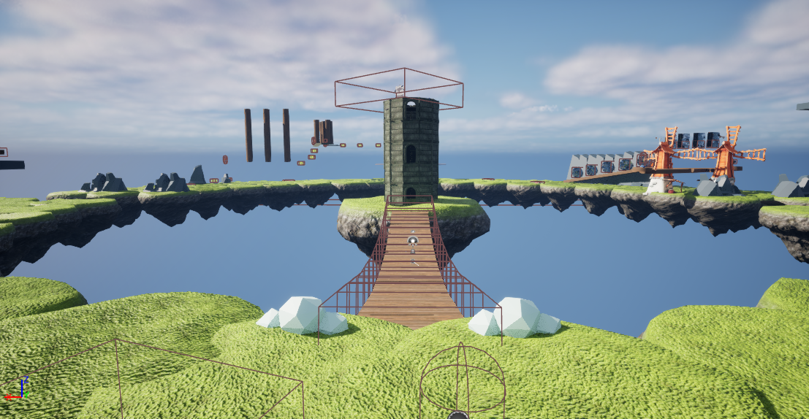

## What is this?
Save the tower is a 3D Mario-like puzzle platformer where you collect items and jump around to make progress. You’re an avid hot air balloon enthusiast. One day, you decided to take your hot air balloon for a journey across an unknown wilderness to the East. Unexpectedly, your hot air balloon runs aground on a floating island, miles above the clouds. Before you can get free, a strange person asks you for help. At the center of their island, an ancient tower is on the verge of falling from the sky. To prevent this and preserve their architecture, you must collect 5 shards and place them at the top of the tower. Only then can the tower be saved.

## Highlighted Content
[Shards](https://j1147.github.io/honors-project-wiki/shard-info)
[Doozy](https://j1147.github.io/honors-project-wiki/shard-info/npcs/doozy)

import { LinkCard, CardGrid } from '@astrojs/starlight/components';

<CardGrid>
  <LinkCard title="Shard (Collectible)" href="honors-project-wiki/collectibles/shard" />
  <LinkCard title="Doozy" href="/honors-project-wiki/characters/doozy" />
  <LinkCard title="Castle Guy" href="characters/castleguy" />
  <LinkCard title="Ending" href="./meta/ending" />
</CardGrid>
