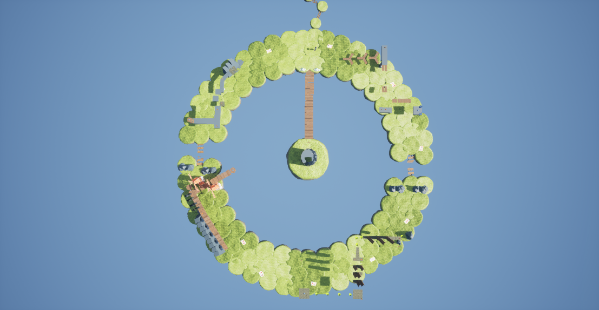

*An aerial view of the game's map.*

The main plot from the player's perspective is as follows:

*You’re an avid hot air balloon enthusiast. One day, you decided to take your hot air balloon for a journey across an unknown wilderness to the East. Unexpectedly, your hot air balloon runs aground on a floating island, miles above the clouds. Before you can get free, a strange person asks you for help. At the center of their island, an ancient tower is on the verge of falling from the sky. To prevent this and preserve their architecture, you must collect 5 shards and place them at the top of the tower. Only then can the tower be saved.*

The game begins with the player (unknowingly beknownst as Timmy) standing outside a hot air ballon, where they encounter Mousey. Mousey exclaims to the player that his island's beloved tower is in danger and that only the player can save it. She then instructs the player to collect the four Shards by doing parkour, and to approach Doozy for the fifth. After doing so, Doozy unveils his final challenge to the player, a race around the island. Only by completing his challenge may the player proceed to the tower. Along the way, the player has been collecting various Bridge Parts so that they may reach the inner island which lies in the center of the area. After climbing the tower, the player meets Castle Guy, who turns out to be an enemy of the islanders and their tower. The game ends in a tragedy as the player is thrown into deep space and Castle Guy carries out his unknown machinations on the tower.