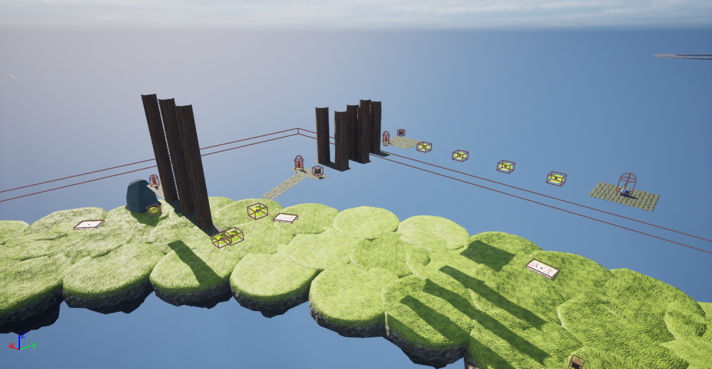

The **Lunge Shard** is the second shard to be encountered. 

## Bridge Parts
 * After the neo jumps.
 * Before the slimeball section.
 * Behind a rock beyond the first slimeball.

## Trivia
* The Lunge Shard is the only course that is entirely in the air.
* Its course has some of the most difficult jumps in the game.