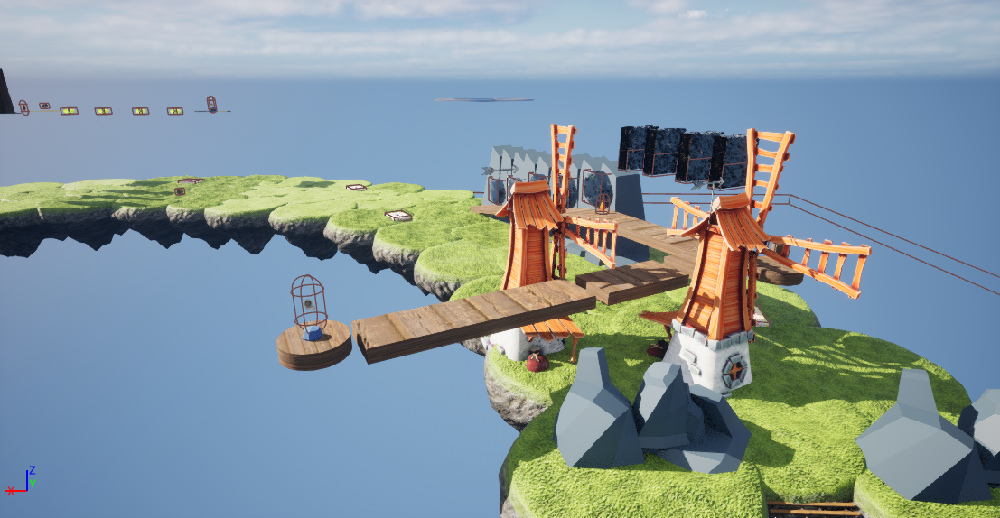

The **Dodge Shard** is the third Shard in the game, with a magenta appearance. This is the first course in the natural sequence where obstacles exist that can kill the player. When the player dies, they are either sent back to the start or the last touched checkpoint. No Bridge Parts or Shards are lost on death. The first section consists of many Push-Outs, metal cylinders that attempt to shove the player off the ledge. Following these are four Squishers, which are capable of killing the player. The player must wait for every Squisher to retreat before they can pass. The last part has two Deadly Windmills, of which the player must jump through their blades without getting chopped up. 

## Bridge Parts
 * Behind the mountains.
 * After the Squishers.

## Trivia
* Unlike the previous Shards, there are only two Bridge Parts in the course.
* This section has the most obstacles that can kill the player (6 in total).
* There are only two real jumps in the main course, and even these can barely be qualified as jumps.
