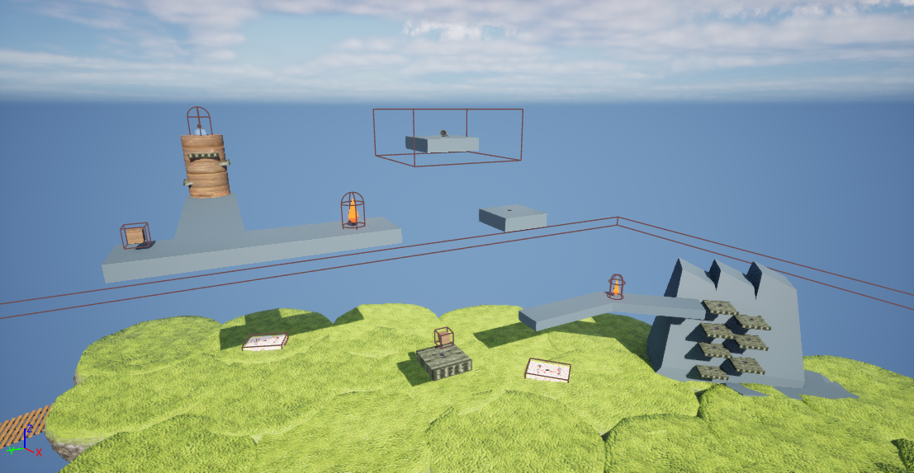

The **Hoist Shard** is the fourth Shard to be encountered, and is nicknamed after the vertical "hoisting" motion that results from its jumps. It has a complex red and purple appearance, and is physically the largest Shard. The first section introduces a new mechanic with oscillating platforms. The player must time a set of 8 jumps on platforms that disappear into the mountainside. The next area is dedicated to two elevators, the first going down, and the second going up. On the up elevator, the player may be squished against the ceiling; if this happens, the player will die. The final part is composed of more oscillating platforms, this time located on a narrow cylinder. After obtaining the Shard, the player must proceed to the starting area to talk to Doozy in order to continue.

## Bridge Parts
 * Behind the mountains.
 * On the lowermost reaches of the vertical elevator.
 * After the elevators.

## Trivia
* This Shard was originally called the "Ladder Shard" and was going to contain a static version of the oscillating platforms section.
* The down elevator is the only area in the game where waiting on a jump may cause the player to fall off the course.