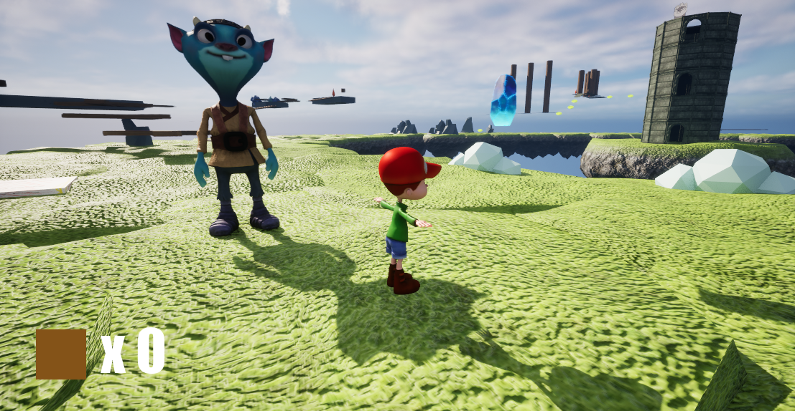

The **Race Shard** is the fifth and final Shard in the game, and is not obtainable by parkour alone. It is also the only Shard that relies upon the player unlocking previous Shards. After four Shards have been collected, the player must return to Doozy and meet his demands. Doozy states that the player must lap the island in under 60 seconds to prove themselves capable of receiving his Shard. Luckily, many speedpads are located around the island. After completing the race, Doozy yields his Shard and the player may proceed to the ending.

## Bridge Parts
**There are no Bridge Parts associated with this Shard.**

## Trivia
* Originally, it was planned for Doozy to engage in an actual race against the player. In the final game, however, the race is timed instead.
* There are no anti-cheats in place during the race. Returning to Doozy results in him giving the player the Shard regardless of the distance travelled.